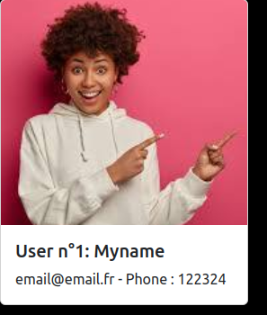
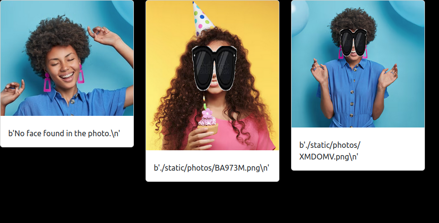
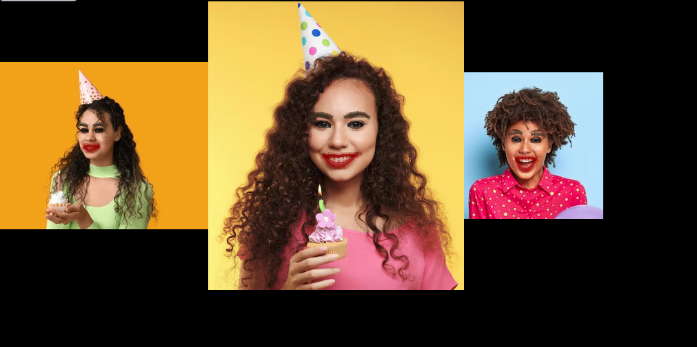
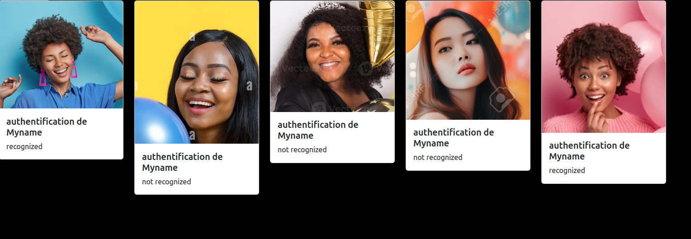

# amazon-hub
- Arriver dans un hub d'aérogare ou un logement hub avec facial recognition, partitions de musique, gps, lunettes de soleil sur photos ou maquillage

- (sudo apt install libbrotli-dev
- trouver libjxl
- pip install --upgrade pip setuptools wheel
- python3.9 -m pip install --upgrade pip setuptools wheel testresources
- pip install p5py
- pip install PEP517
- python3.9 -m pip install dlib cmake)
- 
- Installation
- Python 3 / Python 2 are fully supported. Only macOS and
- Linux are tested. I have no idea if this will work on Windows.
- 
- Step 1: Install the required machine learning models using pip3 (or pip2 for Python 2):
- pip3 install git+https://github.com/ageitgey/face_recognition_models
- Step 2: Install this module from pypi using pip3 (or pip2 for Python 2):
- pip3 install face_recognition
- IMPORTANT NOTE: It’s very likely that you will run into problems when pip tries to compile
- the dlib dependency. If that happens, check out this guide to installing
- dlib from source (instead of from pip) to fix the error:
- How to install dlib from source
- After manually installing dlib, try running pip3 install face_recognition
- again to complete your installation.

- wget https://repo.anaconda.com/miniconda/Miniconda3-latest-Linux-x86_64.sh
- sudo chmod 755 Miniconda3-latest-Linux-x86_64.sh
- ./Miniconda3-latest-Linux-x86_64.sh

- conda create -n py36 python=3.6.10

- # you should initialize conda during installation and restart shell after installation to get started with conda or run $ source .bashrc from you home directory

- conda activate py36
- pip install dlib
- There is now1 an environment variable (documentation2 | relevant merge request) you can use to pass the CMAKE_POLICY_VERSION_MINIMUM value mentioned in the other answer:

- export CMAKE_POLICY_VERSION_MINIMUM=3.5

- pip install opencv-python
